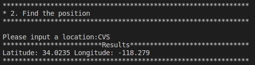
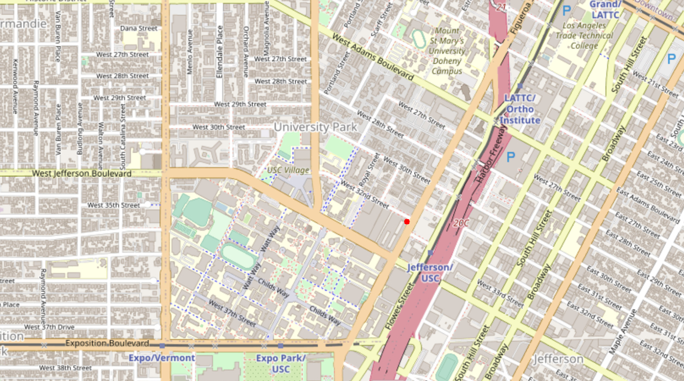

# EE599 Final Project - TrojanMap

## TrojanMap

> This project focuses on using data structures and graph search algorithms to build a mapping application.
<p align="center"></p>

- Please clone the repository, look through [README.md](README.md) and fill up functions to finish in the project.
- Please make sure that your code can run `bazel run/test`.
- In this project, you will need to fill up [trojanmap.cc](src/lib/trojanmap.cc) and add unit tests in tests.
- Do **Not** change or modify any given functions that are specified not to change in [trojanmap.cc](src/lib/trojanmap.cc) and [trojanmap.h](src/lib/trojanmap.h). Unexpected changes will result in zero credit. Only modify and complete the functions that are specified.
- For coding questions, there is a **black box** testing for each question. All points are only based on passing the tests (i.e. we don't grade your work by your source code). Try to do comprehensive testing before your final submission.
- For submission, please push your solutions to your own Github before the deadline.
- **Due Dates**:
  - **Specifying team members**: You can work on the project in teams of 1 to 2 students. Please [specify your team members](https://docs.google.com/spreadsheets/d/1lkI0viun0lW3rjniwAyFGl9e8kTKXqmRoRFzzxDueSE/edit?usp=sharing) by Wednesday November 4th.
  - **Video presentation**: Monday November 23rd (In the class). Each team should create a 1 to 2 minute presentation that includes: quick introduction of the team, explanation of the solution architecture (High level. Use slides and some graphs. No need to go into code details. Focus on one interesting part and explain that if you want). You can refer to the [sample videos from the previous semester](https://github.com/ourarash/EE599_SP2020_Final_Project).
  - **Final report: Friday**, November 27th by 6:30 pm
- Total: 120 points. 100 points is considered full credit.

---

## The data Structure

Each point on the map is represented by the class **Node** shown below and defined in [trojanmap.h](src/lib/trojanmap.h).

```cpp
class Node {
  public:
    std::string id; // A unique id assign to each point
    double lat;     // Latitude
    double lon;     // Longitude
    std::string name; // Name of the location. E.g. "Bank of America".
    std::vector<std::string> neighbors; // List of the ids of all neighbor points.
};
```

---

## Prerequisites

### OpenCV Installation

For visualizations we use OpenCV library. You will use this library as a black box and don't need to worry about the graphic details.

**Notice**: Installing this library may take a long time. This is only for visualization. You can still start coding even without installing this library and visualization.

Use the following commands to install OpenCV.

```shell
cd TrojanMap
git clone https://github.com/opencv/opencv.git
cd opencv/
mkdir build install
cd build
```

For Ubuntu,
```shell
sudo apt-get install cmake libgtk2.0-dev pkg-config
sudo apt install libcanberra-gtk-module libcanberra-gtk3-module
```

For MacOS,
```shell
brew install cmake
```

Next, type the following, but make sure that you set the **path_to_install_folder** to be the absolute path to the install folder under opencv.

```shell
cmake -D CMAKE_INSTALL_PREFIX=**path_to_install_folder** -D BUILD_LIST=core,highgui,imgcodecs,imgproc,videoio  -D WITH_TBB=ON -D WITH_OPENMP=ON -D WITH_IPP=ON -D CMAKE_BUILD_TYPE=RELEASE -D BUILD_EXAMPLES=OFF -D WITH_NVCUVID=ON -D WITH_CUDA=ON -D BUILD_DOCS=OFF -D BUILD_PERF_TESTS=OFF -D BUILD_TESTS=OFF -D WITH_CSTRIPES=ON -D WITH_OPENCL=ON ..
make install
```

For example, if cloned this repo under "/Users/ari/github/TrojanMap", you should type:

```shell
cmake -D CMAKE_INSTALL_PREFIX=/Users/ari/github/TrojanMap/opencv/install  -D BUILD_LIST=core,highgui, imgcodecs,imgproc,videoio  -D WITH_TBB=ON -D WITH_OPENMP=ON -D WITH_IPP=ON -D CMAKE_BUILD_TYPE=RELEASE -D BUILD_EXAMPLES=OFF -D WITH_NVCUVID=ON -D WITH_CUDA=ON -D BUILD_DOCS=OFF -D BUILD_PERF_TESTS=OFF -D BUILD_TESTS=OFF -D WITH_CSTRIPES=ON -D WITH_OPENCL=ON ..
make install
```

---

## Run the program

Please run:

```shell
bazel run src/main:main
```

If everything is correct, this menu will show up.

```shell
**************************************************************
* Select the function you want to execute.
* 1. Autocomplete
* 2. Find the position
* 3. CalculateShortestPath
* 4. Traveling salesman problem
* 5. Exit
**************************************************************
```

## Test the program

We create some tests for you to test your program, please run

```shell
bazel test tests:tests:trojanmap_test
```

Please add you test in the [trojanmap_test_student.cc](tests/trojanmap_test_student.cc) and run

```shell
bazel test tests:trojanmap_test_student
```

## Your task is to implement a function for each menu item

## Step 1: Autocomplete the location name

```c++
std::vector<std::string> Autocomplete(std::string name);
```

We consider the names of nodes as the locations. Implement a method to type the partial name of the location and return a list of possible locations with partial name as prefix. Please treat uppercase and lower case as the same character.

Example:

Input: "ch" \
Output: ["ChickfilA", "Chipotle Mexican Grill"]

Input: "ta" \
Output: ["Target", "Tap Two Blue"]

```shell
1
**************************************************************
* 1. Autocomplete
**************************************************************

Please input a partial location:ch
*************************Results******************************
ChickfilA
Chipotle Mexican Grill
**************************************************************
```

## Step 2: Find the place

```c++
std::pair<double, double> GetPosition(std::string name);
```

Given a location name, return the latitude and longitude. There is no duplicate location name. Mark the locations on the map. If the location does not exists, return (-1, -1).

Example:

Input: "ChickfilA" \
Output: (34.0167334, -118.2825307)

Input: "Ralphs" \
Output: (34.0317653, -118.2908339)

Input: "Target" \
Output: (34.0257016, -118.2843512)

```shell
2
**************************************************************
* 2. Find the position
**************************************************************

Please input a location:Target
*************************Results******************************
Latitude: 34.0257 Longitude: -118.284
**************************************************************
```

<p align="center"></p>

## Step 3: CalculateShortestPath

```c++
std::vector<std::string> CalculateShortestPath(std::string location1_name,
                                               std::string location2_name);
```

Given 2 locations A and B, find the best route from A to B. The distance between 2 points is the euclidean distance using latitude and longitude. You can use Dijkstra algorithm or A\* algorithm. Compare the time for the different methods. Show the routes on the map. If there is no path, please return empty vector.

Example:

Input: "Ralphs", "ChickfilA" \
Output: ["2578244375", "5559640911", "6787470571", "6808093910", "6808093913", "6808093919", "6816831441",
      "6813405269", "6816193784", "6389467806", "6816193783", "123178876", "2613117895", "122719259",
      "2613117861", "6817230316", "3642819026", "6817230310", "7811699597", "5565967545", "123318572",
      "6813405206", "6813379482", "544672028", "21306059", "6813379476", "6818390140", "63068610", 
      "6818390143", "7434941012", "4015423966", "5690152766", "6813379440", "6813379466", "21306060",
      "6813379469", "6813379427", "123005255", "6807200376", "6807200380", "6813379451", "6813379463",
      "123327639", "6813379460", "4141790922", "4015423963", "1286136447", "1286136422", "4015423962",
      "6813379494", "63068643", "6813379496", "123241977", "4015372479", "4015372477", "1732243576",
      "6813379548", "4015372476", "4015372474", "4015372468", "4015372463", "6819179749", "1732243544",
      "6813405275", "348121996", "348121864", "6813405280", "1472141024", "6813411590", "216155217", 
      "6813411589", "1837212103", "1837212101", "6820935911", "4547476733"]

```shell
3
**************************************************************
* 3. CalculateShortestPath
**************************************************************
*************************Results******************************
2578244375
5559640911
6787470571

...

6820935911
4547476733
**************************************************************
```

<p align="center"></p>

## Step 4: The Travelling Trojan Problem (AKA Traveling salesman!)

```c++
std::pair<double, std::vector<std::vector<std::string>>> TravellingTrojan(
      std::vector<std::string> &location_ids);
```

In this section, we assume that a complete graph is given to you. That means each node is a neighbor of all other nodes.
Given a vector of location ids, assume every location can reach every location in the list (Complete graph. Do not care the neighbors).
Find the shortest route that covers all the locations and goes back to the start point. You will need to return the progress to get the shortest
route which will be converted to a animation.  

We will use the following algorithms:

- Brute Force Method
```c++
std::pair<double, std::vector<std::vector<std::string>>> TravellingTrojan(
      std::vector<std::string> &location_ids);
```
- [2-opt Heuristic](https://en.wikipedia.org/wiki/2-opt). Also see [this paper](http://cs.indstate.edu/~zeeshan/aman.pdf)
```c++
std::pair<double, std::vector<std::vector<std::string>>> TravellingTrojan_2opt(
      std::vector<std::string> &location_ids);
```

Show the routes on the map. For each intermediate solution, create a new plot. Your final video presentation should include the changes to your solution.

We will randomly select N points in the map and run your program.

```shell
4
**************************************************************
* 4. Travelling salesman problem                              
**************************************************************

In this task, we will select N random points on the map and you need to find the path to travel these points and back to the start point.

Please input the number of the places:10
Calculating ...
*************************Results******************************
123120189
1931345270
4011837224
4011837229
2514542032
2514541020
6807909279
63068532
214470792
4015477529
123120189
**************************************************************
The distance of the path is:4.61742
**************************************************************
You could find your animation at src/lib/output.avi
```

<p align="center"></p>

<p align="center"></p>

## Report and Rubrics:

Your final project should be checked into Github. The README of your project is your report.

### Report:

Your README file should include two sections:

1. High-level overview of your design (Use diagrams and pictures)
2. Detailed description of each function and its time complexity.
3. Discussion, conclusion, and lessons learned.

### Rubrics:

1. Implementation of auto complete: 10 points.
2. Implementation of GetPosition: 5 points.
3. Implementation of shortest path: 20 points.
4. Implementation of Travelling Trojan: 
   1. Brute Force: 10 points
   2. 2-opt: 15 points.
   3. Animated plot: 10 points.
5. Creating reasonable unit tests: 20 points.
6. Video presentation and report: 10 points.
7. **Extra credit items**: Maximum of 20 points:
   1. A second shortest path algorithms (For example, you can implement both Bellman-Ford and Dijkstra): 10 points.
   2. [3-opt](http://cs.indstate.edu/~zeeshan/aman.pdf) (If you chose to implement 2-opt for Travelling Trojan): 20 points.
   3. [Genetic algorithm](https://www.geeksforgeeks.org/traveling-salesman-problem-using-genetic-algorithm/) implementation for Travelling Trojan: 20 points.

## Final report:

## Small modification in the PrintMenu() function
Because I have apply three method at the TSP function, so I make a small change at the **PrintMenu()** function to let people be able to select a method to do the TSP function. After enter the number of points, the programming will print following menu:

```shell
**************************************************************
* 1. Brute Force                                              
* 2. 2-opt                                                    
* 3. 3-opt                                                    
**************************************************************
```

You can input the number of method to let the system choose the selected method to solve TSP. If your input is an invalid input(e.g. 4, "I want to use 3-opt method"...). The system will remind you that it is an invalid input and use the default method(Brute Force) to solve TSP.


## Functions in this project:

### 1. Simple functions which return related parameter
In this project, it also has some simple functions which return related parameters based on the input location ID as following:
```c++
double GetLat(std::string id);

double GetLon(std::string id);

std::string GetName(std::string id);

std::vector<std::string> GetNeighborIDs(std::string id);
```

For these function, I use a private variable, data, in this project. It is a map variable whose key is the id of locations and value is the node to the id. Thus, I can use this private variable to find the node by the inputted id and return the related parameter of this node.

### 2. Helper functions to calculate the distance between locations and the length of a path
Because of the last two main functions for the menu item, it is necessary to have two functions which can calculate the distance for different situation as following:

```c++
double CalculateDistance(const Node &a, const Node &b);

double CalculatePathLength(const std::vector<std::string> &path);
```

The first function is to calculate the distance between two locations, and the other one is to calculate the length of a vector of locations. Let's explain the first function at first.

In the function **CalculateDistance()**, I use the Haversine Formula to calculate the distance between two locations based on their latitudes and longitudes.

In the function **CalculatePathLength()**, I calculate the distances between two adjacent locations in the vector and accumulate them as the sum length of this path.

### 3. First function for the menu: Autocomplete

The first main function for the menu in this project is to search a place by a unsensitive partial name as prefix. Here is the header of this function: 

```c++
std::vector<std::string> Autocomplete(std::string name);
```

In this function, I use the function **equal()** from STL to find name in the map which match the requirement in a loop. If it doen't exist the required name, it will return an empty result. Here is the code diagram of this function:

<p align="center"></p>

The time complexity of this function is O(n).

Here are some results of the live demo:

<p align="center"></p>

<p align="center"></p>

<p align="center"></p>

When the project can't find any location which requires your input, its result will be:

<p align="center"></p>

### Find the position of a location

This function can return the position of a given location name or (-1,-1) if there isn't a location has the given name. Here is the header of this function:

```c++
std::pair<double, double> GetPosition(std::string name);
```

This function can easily achieve it by using a loop for data variable to find a location which meet the requirement. The time complexity of this function is O(n).

Here is the code diagram of this function:

<p align="center"></p>

The time complexity of this function is O(n).

Here are some results of the live demo:

<p align="center"></p>

In the main programming, it will also plot the location on the map like following picture:

<p align="center"></p>

In following case, although Target is included in the map, the input should be case-sensitive. Therefore, when we input "target", it won't return the position of Target.

<p align="center"></p>

### Calculate Shorteat Path

Here is the head file of the function:

```c++
std::vector<std::string> CalculateShortestPath(std::string location1_name,
                                               std::string location2_name);
```

It will calculate and return the shortest path between location 1 and location 2. In this function, I use the Bellman-Ford algorithm, and here is the code diagram:

<p align="center"></p>

According to this diagram, the time complexity of this function is O(n^2 * V), which V is a specific number related to the neighbor number of each location.

Here is a single process of the process of update the d map. if we start from node 0, and we found that the current distance[n+1] is greater than the sum of distance[n] and the distance between node n and node n+1, we will use the sum of distance[n] and the distance between node n and node n+1 to update the value of distance[n+1].

<p align="center"></p>

Here is some results of this function. Because it is also a case sensitive function, you will get following result if you still using "target" as one of the inputs:

<p align="center"></p>

Because the list of path may be a bit harder to see in the programming, I use the plot of the path as the result. Here is the plot of the shortest path between Target and CVS:

<p align="center"></p>

and we compare it with the recommand route on the Google map:

<p align="center"></p>

We can see that they have similiar result.

Here is the plot of the shortest path between Ralphs and CVS:

<p align="center"></p>

and we compare it with the recommand routes on the Google map:

<p align="center"></p>

In this case, our result is a bit different from the Google map. I think that one of the reason is that the Google map may not only consider the distance between two location, it will also consider some more elements such as if there exists some roads which is blocked.

### Traveling Trojan based on TSP

Here is the header of this funciton:

```c++
std::pair<double, std::vector<std::vector<std::string>>> TravellingTrojan(
      std::vector<std::string> &location_ids);

std::pair<double, std::vector<std::vector<std::string>>> TravellingTrojan_2opt(
      std::vector<std::string> &location_ids);

std::pair<double, std::vector<std::vector<std::string>>> TravellingTrojan_3opt(
      std::vector<std::string> &location_ids);
```

This function will randomly select locations based on your input and find the sbortest route which can let you reach these locations and return to the start location. Here is the code diagram of this function:

<p align="center"></p>


According to this diagram, we can see that the main idea of this function is to generate new route and find if it has a shorter length. I also use three different algorithms in this part.

The first algorithm is Brute Force Method, it will generate all possible routes based on the inputted list, and then it will find the one whose length is shortest. The time complexity of this method is O(n!) which is a bad run time in the computer science field. Thus, I apply a little optimation in my code, I use a If statement to let it abandon those routes which has longer distance than the inputted route.

Here is one result of the TSP function based on Brute Force Method:

The list of selected points:

<p align="center"></p>

The amimated plot:

<p align="center"></p>

The final TSP solusion:

<p align="center"></p>


I also apply the 2-opt method to solve the TSP. The main idea of 2-opt is to delete two edges from original route and reconnect them to generate a new route. Here is an example of a single process of 2-opt method. 

<p align="center"></p>

The left part is the original route. We delete two edges, 1->2 and 4->5, and reconnect them to get the new route at the right part. Thus, the transformation from left route to right route is following:

<p align="center"></p>

It is clear that the a single process of 2-opt swap can be think as reversing a part in the middle of the original route, so we can use 2-opt swap iteratively to the original route and recursively do the same process to the new routes to generate any possible solution to TSP. The final time complexity of 2-opt method is O(n^2)

Here is one result of the TSP function based on 2-opt Method:

The list of selected points:

<p align="center"></p>

The amimated plot:

<p align="center"></p>

The final TSP solusion:

<p align="center"></p>


3-opt method is similiar with 2-opt method, it deletes three edges from original route and reconnect them in 7 different styles. Here is an example of a single process of 3-opt method. 

<p align="center"></p>

We use the same original route as the 2-opt case, and we delete the three edges, 1->2, 3->4, and 5->0. We will get three different subroutes, 0->1, 2->3 and 4->5. To make it more clear, we name them as A, B and C.

Here is the first style to reconnect:

<p align="center"></p>

We reconnect the end of A to the end of B, the begin of B to the end of C, and the begin of C to begin of A. To simplify it, we can call the new route as [A->,B<-,C<-].

The second style is following, and we call it as [A->,C->,B->]:

<p align="center"></p>

The third style is following, it is [A->,C<-,B->]:

<p align="center"></p>

In addition, the other three style is [A->,B<-,C->],[A->,B->,C<-] and [A->,C<-,B<-]. They are also the style of 2-opt, so it is easy to modify 2-opt method code to 3-opt method by adding the first three 3-opt swap method in the 2-opt method code.

Here is the result of the TSP function based on 3-opt Method:

<p align="center"></p>

The amimated plot:

<p align="center"></p>

The final TSP solusion:

<p align="center"></p>

